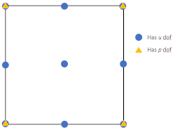

# Elements for coupled problems

This repository is a collection of elements for <a href="http://projects.ce.berkeley.edu/feap/" target="_blank">FEAP</a> to help address coupled problems. The elements, provided here are generated using <a href = "http://symech.fgg.uni-lj.si/" target="_blank">AceGen</a>. AceGen is available as an add-on for Mathematica and facilitates the automatic generation of user elements using an automatic differentiation approach. A detailed discussion on AceGen can be found in the work of Korelc and Wriggers [1]. The FEAP programmer manual [2] outlines the usage of user element in FEAP and user issues can be addressed through the FEAP Forum [3]. 

## Folder structure

1. **Multiphysics phenomena (Poroelastic, Thermoelastic etc.):** The folder contains elements developed to address the particular phenomenon. Each element type uses a sub-folder of its own where the relates AceGen file, generated FEAP element and FEAP input file for examples are provided.

2. **dependencies:** Include the files required for generating the FEAP element with AceGen and also running the generated elements. More information on its usage is outlined below.

## Poro-elasticity

### Q9/Q4 Taylor-Hood element
This 2-D nine-noded element is developed as a part of the work [4] presented as a part of the Festschrift on the occasion of the 70th birthday of <a href="https://www.ikm.uni-hannover.de/de/wriggers/" target="_blank">Prof. Peter Wriggers</a>.

The element topology is as shown below. It utilizes a Q9/Q4 Taylor-Hood type interpolation for the u/p dependent variables, respectively.

# Using AceGen with FEAP

AceGen is a Mathematica add-on. The Mathematica files (\*.nb) use the AceGen tool-box to generate user elements for FEAP. Here, we will discuss how to run these files to generate the user elements. The steps involved include:

1. Generate the user element from Mathmatica
2. Compile the generated element with FEAP
3. Run an example problem with FEAP

## Generating the elements with AceGen

1. The Mathematica files (\*.nb) are available in the folder **Phenomena/Element-Type**.

2. Copy the element file (\*.nb) of interest to a local folder.

3. Copy the AceGen dependency available in **dependencies/AceGen/SMTFEAP.mf** into the same local directory (as in step 2)

4. In Mathematica, click the menu item: **Evaluation >> Evaluate Notebook**. This will generate the user element (\*.f) in the same folder. 

5. For more information on how to manipulate the Mathematica files, please refer Korelc and Wriggers [1].

## Using the generated elements with FEAP

1. Copy the user element (\*.f) generated by AceGen into FEAP. It is recommended to copy the files to **FEAP86/user** folder.

2. Compile FEAP. For more help on compiling, check out the Youtube videos on compiling FEAP on <a href="https://www.youtube.com/watch?v=_ohQ__rqq3Y"> Mac or Linux</a> or <a href="http://www.youtube.com/watch?v=7QAh6QvOT6s">Windows</a>

3. Upon successful compilation, the element is now available for usage with FEAP.

4. For more information on running problems with FEAP, check out the FEAP <a href = "http://projects.ce.berkeley.edu/feap/manual_86.pdf">user</a> and <a href="http://projects.ce.berkeley.edu/feap/example_86.pdf">example</a> manuals.

5. For any queries, please write to us on the <a href=http://feap.berkeley.edu/forum/index.php>FEAP user forum</a>

# References
1. J. Korelc and P. Wriggers, "Automation of Finite Element Methods," Springer International Publishing, Switzerland (2016) [<a href="https://www.springer.com/gp/book/9783319390031">Link</a>]

2. <a href=http://projects.ce.berkeley.edu/feap/pmanual_86.pdf>FEAP programmer manual</a>

3. <a href=http://feap.berkeley.edu/forum/index.php>FEAP user forum</a>

4. A. B. Harish, R. L. Taylor and S. Govindjee, "A Poroelastic Element for FEAP Using AceGen," Current Trends and Open Problems in Computational Mechanics, Springer (2020) [Link]
