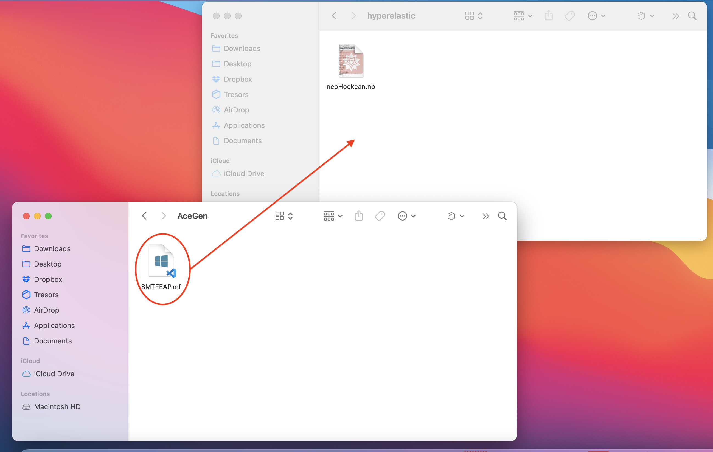

# Automated generation of user elements for FEAP

## How to cite

Harish, A. B. and Taylor, R. L. and Govindjee, S., "Automated Generation of User Elements (UEL) for FEAP," SEMM Report UCB/SEMM-21/01 (2021)

## Questions and user requests

If you have any questions related to the repository or would like help to explore new elements and contribute to the repository, this can be raised on the [FEAP user forum](http://feap.berkeley.edu/forum/index.php).

## Folder information

This repository has the files related to the AceGen template that has been developed to automatically generate user elements for [FEAP](http://projects.ce.berkeley.edu/feap/). The folders available in this repository are as below:

- **user-elements**: This folder contains the Mathematica notebooks and the generated FEAP user elements (*elmtXX.f*)

    - *user-elements/thermal*: Steady-state and transient thermal elements. The formulation and AceGen implementation are described in Sec 5.1 of Harish et. al. [1].

    - *user-elements/linelastic*: Quasi-static and dynamic small-strain linear elastic material models. The formulation and AceGen implementation are described in Sec 5.2 of Harish et. al. [1].

    - *user-elements/poroelastic*: Dynamic small-strain poroelastic material models. The formulation and AceGen implementation are described in Sec 5.3 of Harish et. al. [1].

    - *user-elements/hyperelastic*: Large-strain quasi-static hyperelastic material models. The formulation and AceGen implementation are described in Sec 5.4 of Harish et. al. [1].

- **dependencies**: This contains the dependencies for using the Mathematica notebooks and the generated FEAP user elements. 

    - *dependencies/AceGen*: The files in this folder need to be copied to the same folder as the Mathematica notebook to generate the user element. More information can be found in the section [How to generate user elements](#how-to-generate-user-elements) 
    
    - *dependencies/FEAP*: The files in this folder need to be copied into the FEAP folder and compiled prior to usage. More information can be found in the section [How to use the generated elements](#how-to-use-the-generated-elements)

- **benchmarks**: This contains the FEAP input files used in the validation examples. These input files use the standard FEAP elements. These examples are used to compare with the results obtained from AceGen-generated FEAP user elements.

- **examples**: This folder has the FEAP input files that use the AceGen-generated elements. The input files are the same problems as in the *benchmarks* folder.

    - *thermalSteady*: Steady-state thermal conduction in 2-D. The comparison of numerical results with the benchmark problem is described in Sec 5.1.3 and particularly in Fig. 5.7 of Harish et. al. [1].

    - *thermalTransient*: Transient thermal conduction problem in 2-D. The comparison of numerical results with the benchmark problem is described in Sec 5.1.3 and particularly in Fig. 5.8 of Harish et. al. [1].

    - *elasticStatic*: 2-D quasi-static uniaxial tensile test, in small deformation range, on an elastic material. The comparison of numerical results with the benchmark problem is described in Sec 5.2.3 and particularly in Fig. 5.15 of Harish et. al. [1].

    - *elasticDynamic*: 2-D dynamic uniaxial tensile test, in small deformation range, on an elastic material. The comparison of numerical results with the benchmark problem is described in Sec 5.2.3 and particularly in Figs. 5.16 and 5.17 of Harish et. al. [1].

    - *poroelastic*: 2-D Mandel and consolidation problems. The comparison of numerical results with the benchmark problem is described in Sec 5.3.5 and particularly in Figs. 5.24 and 5.26 of Harish et. al. [1].

    - *neoHookean*: 2-D quasi-static uniaxial tensile test, in large deformation range, on a neo-Hookean material. The comparison of numerical results with the benchmark problem is described in Sec 5.4.3 and particularly in Fig. 5.32 of Harish et. al. [1].

- **common**: This folder contains images used in the README files related to this repository.

## How to generate user elements

- Copy the *SMTFEAP.mf* file from the folder *dependencies/AceGen* into the same folder as the Mathematica notebook. The Mathematica noteboks are available in the folder *user-elements*.

- Open the Mathematica notebook and use *Evaluate Notebook* from the *Evaluate* menu to compile the Mathematica notebook as shown below

- Upon starting to compile, often, Mathematica can ask one to evaluate the initialization cells. It is recommended to select *No* option, as shown below

- Upon successful compilation, the Mathematica notebook shows a confirmation that includes the element number. 

- In addition, upon successful compilation, the user element (*elmtXX.f*) and an *AceShare* folder are created in the same folder as the Mathematica notebook. The number *XX* is controlled by the name provided in the Mathematica notebook.

- Often, one of the common errors is that the *SMTFEAP.mf* is not in the same folder as the Mathematica notebook. This results in an error that says "*Splice file doesn't exist*" as shown below.

## How to use the generated elements

- 

## References

1. Harish, A. B. and Taylor, R. L. and Govindjee, S., "Automated Generation of User Elements (UEL) for FEAP," SEMM Report UCB/SEMM-21/01 (2021)