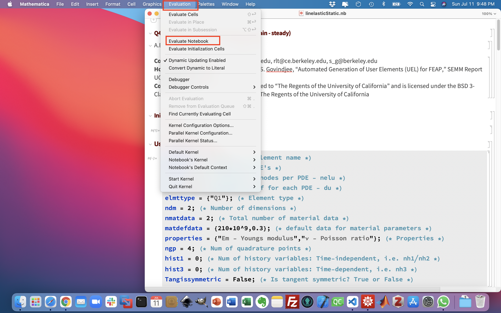
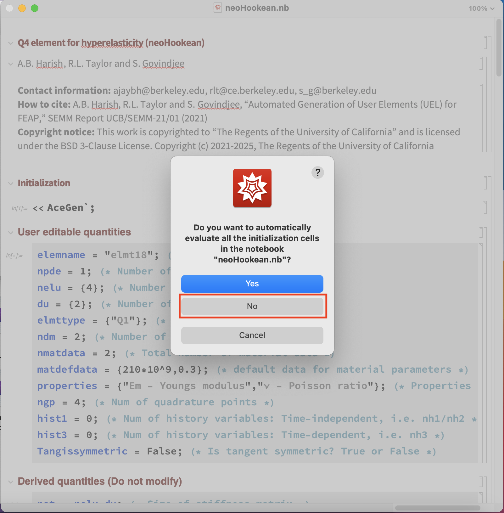
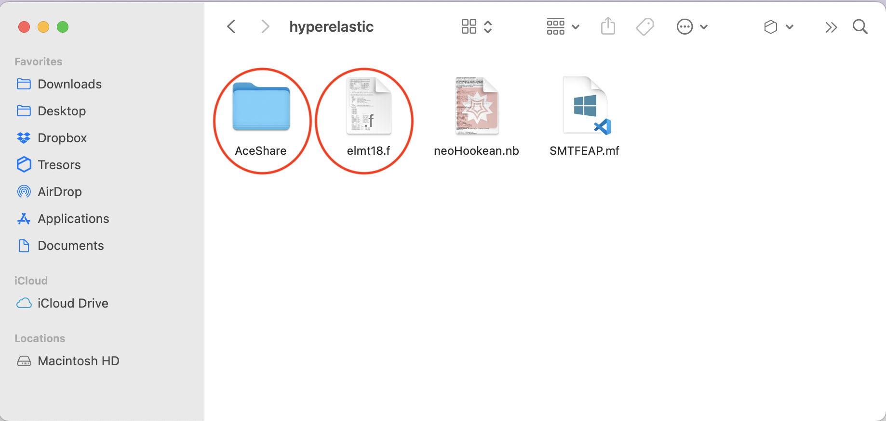
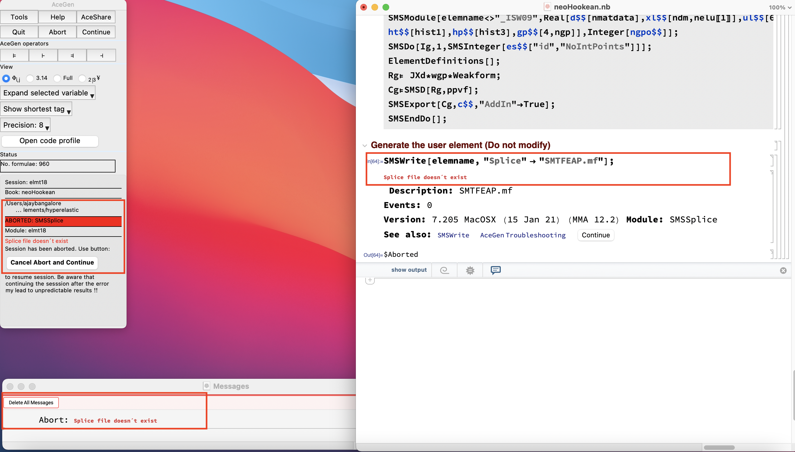

# Automated generation of user elements

## How to cite

Harish, A. B. and Taylor, R. L. and Govindjee, S., "Automated Generation of User Elements (UEL) for FEAP," SEMM Report UCB/SEMM-21/01 (2021)

## Contact information

Any questions related to the repository can be raised on the [FEAP user forum](http://feap.berkeley.edu/forum/index.php).

## Folder information

This repository has the files related to the AceGen template that has been developed to automatically generate user elements for [FEAP](http://projects.ce.berkeley.edu/feap/). The folders available in this repository are as below:

- **user-elements**: This folder contains the Mathematica notebooks and the generated FEAP user elements (*elmtXX.f*)

    - *user-elements/thermal*: Steady-state and transient thermal elements.

    - *user-elements/linelastic*: Quasi-static and dynamic small-strain linear elastic material models.

    - *user-elements/poroelastic*: Dynamic small-strain poroelastic material models.

    - *user-elements/hyperelastic*: Large-strain quasi-static hyperelastic material models.

- **dependencies**: This contains the dependencies for using the Mathematica notebooks and the generated FEAP user elements. 

    - *dependencies/AceGen*: The files in this folder need to be copied to the same folder as the Mathematica notebook to generate the user element. More information can be found in the section [How to generate user elements](#how-to-generate-user-elements) 
    
    - *dependencies/FEAP*: The files in this folder need to be copied into the FEAP folder and compiled prior to usage. More information can be found in the section [How to use the generated elements](#how-to-use-the-generated-elements)

- **benchmarks**:

- **examples**:

- **common**:

## How to generate user elements

- Copy the *SMTFEAP.mf* file from the folder *dependencies/AceGen* into the same folder as the Mathematica notebook. The Mathematica noteboks are available in the folder *user-elements*.

- Open the Mathematica notebook and use *Evaluate Notebook* from the *Evaluate* menu to compile the Mathematica notebook as shown below

- Upon starting to compile, often, Mathematica can ask one to evaluate the initialization cells. It is recommended to select *No* option, as shown below

- Upon successful compilation, the Mathematica notebook shows a confirmation that includes the element number. 

- In addition, upon successful compilation, the user element (*elmtXX.f*) and an *AceShare* folder are created in the same folder as the Mathematica notebook. The number *XX* is controlled by the name provided in the Mathematica notebook.

- Often, one of the common errors is that the *SMTFEAP.mf* is not in the same folder as the Mathematica notebook. This results in an error that says "*Splice file doesn't exist*" as shown below.

## How to use the generated elements

- 